# Introduction
While the basic implementation was simple, I focused on other things such as security, validation,  testability and performance. I chose Amazon AWS Lambda as deployment platform as Deep Consulting Solutions is already making use of it and it would be a plus for me to learn it beforehand. It was relatively easy to use. 

While it is heavy compared to the likes of Fastify, I chose ExpressJS to showcase my existing skills in routing, middleware, etc. My service design however is not optimized for Amazon AWS Lambda, as I believe some features such as helmet and cors middlewares should be handled in a top layer of my microservice, i.e. in Amazon AWS Lambda. Ideally in production, I would use jeremydaly/lambda-api just so that the size of the service remains minimal and app start would be faster. The module jeremydaly/lambda-api achieves it by discarding dependencies in node_modules. 

A fast start is encouraged in Amazon AWS Lambda, as lambda functions are normally halted after a period of inactivity. As a workaround to prevent cold starts, the plugin juanjoDiaz/serverless-plugin-warmup can be used.

# Project Structure
## Folder Structure
My folder structure contains typical NodeJS folders, such as:
- middlewares
- utils
- tests
- validations

However, I chose to use:
- *methods* instead of *controllers* as I used a *wrap* function to control the flow of my data in routing.js. The wrap function's main task is **error handling**.

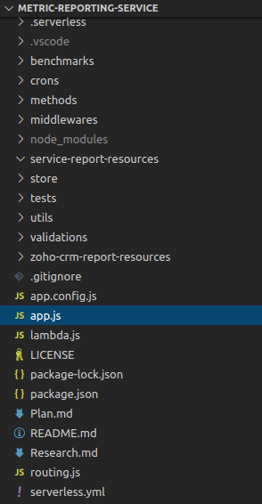

Here is the wrap function:

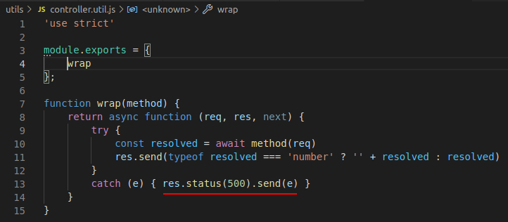

## Configuration/ENV File
Some environment variables used are:
- CRON_EXPRESSION_REMOVE_EXPIRED_VALUES:
    - Dictates at what frequency will the removeExpiredValuesCron repeat itself
    - Note: It's a *performance optimization* for getMetricSumByKey. **The smaller the array of the key, the faster the array filtering will be**.
    - Default: Every 1 minute

- DEBUG:
    - This option can be disabled in prod for better performance or it can be enabled in prod for a debugging session.
    - Default: true

- DEFAULT_STORE
    - Dictates the data structure to be used.
    - Default: Map

- PORT:
    - Dictates on which port the NodeJS server will run.
    - Default: 4444

- PROD:
    - Certain behavior such as logging can be modified based on this option.
    - Default: false

- VALUE_TIMEOUT:
    - Dictates after how many seconds does a value time out.
    - Default: 60 (set to be in accordance with assignment)

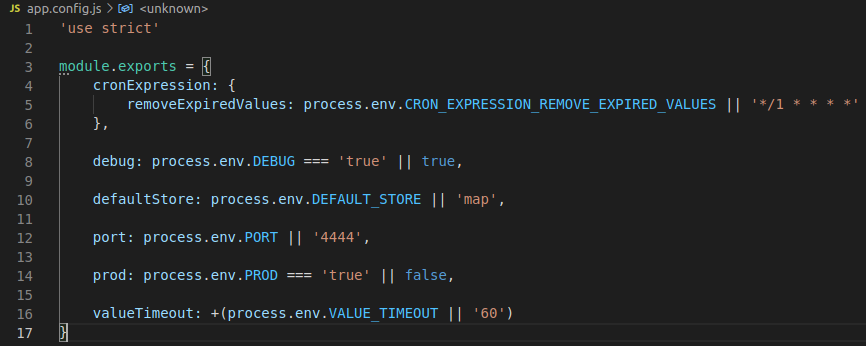

## Main/Entry File
In app.js, basic initialisation operations are done, including:
- new instance of ExpressJS application is created
- a set of middlewares are applied to the ExpressJS application
- the *routing* module is connected to the application
- cron jobs are launched here 

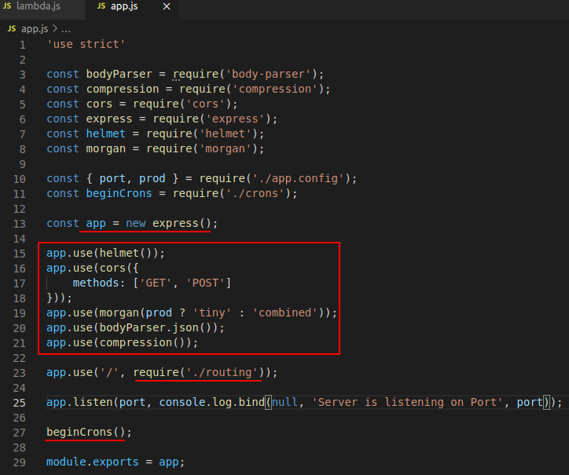

# Routing
Router is separated from app.js to follow the Separation of Concern principal.

Here we have user-defined middleware *validate* which enables us to validate the input from client (see next section Middleware).

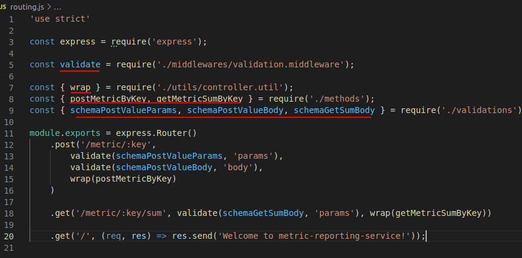

# Middleware
### Validation
This middleware validates input from the clients to prevent unexpected data types to crash the service.
Input:
    - Yup Schema
    - Path (body | params | query): Decides on which property of *req* will be validation occur

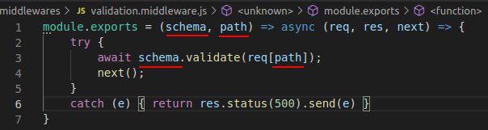

Here are the Schema defined using the Yup npm module.

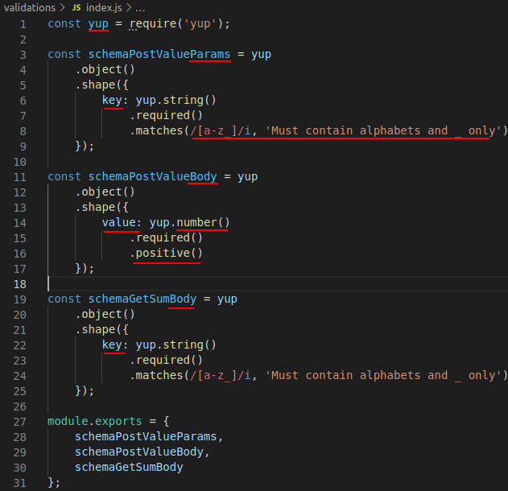

## Security
Here are some security features that are provided by the npm module **helmet**.

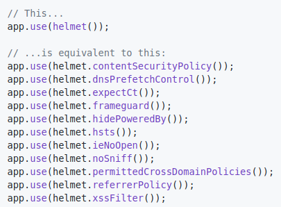

Npm module **cors** has also been used to control requests from certain origins or origins having certain parameters.

## Logging
The npm module **morgan** has been used for http request logging.

Based on the *prod* option, it will give a minimal log or a detailed log.

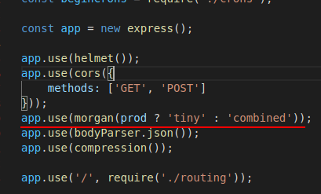

# Controller/Methods
These functions defined in methods/index.js are a bridge between a request from the router's controller wrapper and the store's functions. 

They call the store's functions based on the inputs of the http request.

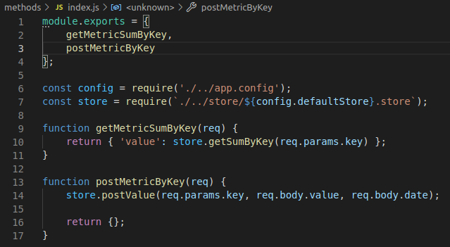

# Store/Data Structure
In Typescript, the definition of the store would be as follows:
```
interface Store {
    [key: string]: {
        value: number,
        date: number
    }[]
}
```

The store has been used as a **Singleton** by exporting an instance of it.

For the date, rather than using the type **Date**, **number** was used.
*Reasons:* 
- A date would contain too many irrelevant, unnecessary information (such as year, month, day, seconds, timezone)
- We are only interested in the **hour and minute** parts of a date *(performance optimization)*
- A cron job executed at every 1 minute by default was used to discard of any values that trespassed the 1 hour line *(performance optimization)*

The conversion from Date to Number:

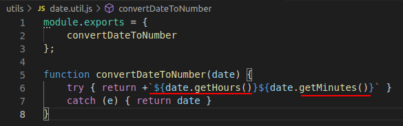

The cron job:

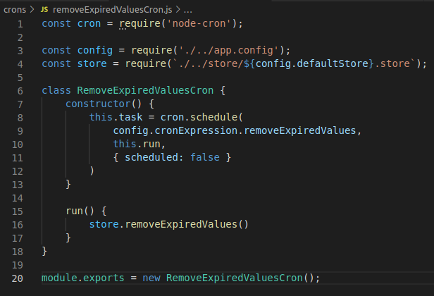

Here are the methods implemented in the store:
```
    postValue(key, value, date = convertDateToNumber(new Date()))

    getSumByKey(key)

    removeExpiredValues()

    contains(key, value, date)

    initArrayByKey(key)
```
See the implementation in store/x.store.js where x is either *map* or *object*. The code is self-explanatory.

### Alternative Data Structure for Array
The npm module splaytree (https://www.npmjs.com/package/splaytree) which is a kind of binary tree could have been used instead of arrays for value storage. I however abandoned the idea for the sake of simplicity.

With splaytree, insertion would be slower but the tree would always be sorted. Consequently, removeExpiredValues implementation could've potentially be made faster by pinpointing the node at which the date exceeds 1 hour. Thus, all nodes which are to its right would be discarded, given that the tree was sorted by an ascending order of date.

# Utils
Function convertDateToNum was used for date storage, but without the many irrelevant, unnecessary information (such as year, month, day, seconds, timezone).


# Testing
Jest was used for testing.

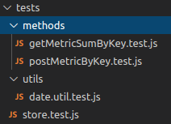

## Unit Testing
### Store
Here are some unit tests for all store methods. Basic test cases covered.
```
for (const storeName of ['map', 'object']) {
    const store = require(`../store/${storeName}.store`);

    beforeEach(() => store.initArrayByKey('test_key'));

    test('Store should allow Object to be stored in it (postValue)', () => {

    });

    test('Store should return sum of metrics by key (getSumByKey)', () => {

    });

    test('Store should return sum of non-expired metrics by key (getSumByKey)', () => {

    });

    test('Store should remove all expired values (removeExpiredValues) ', () => {

    });

    test('Store should tell if it contains an Object (contains) or not', () => {

    });

    test('Store should allow its arrays to be initialized (initArrayByKey)', () => {

    });
}
```

### Utils
Function: convertDateToNumber

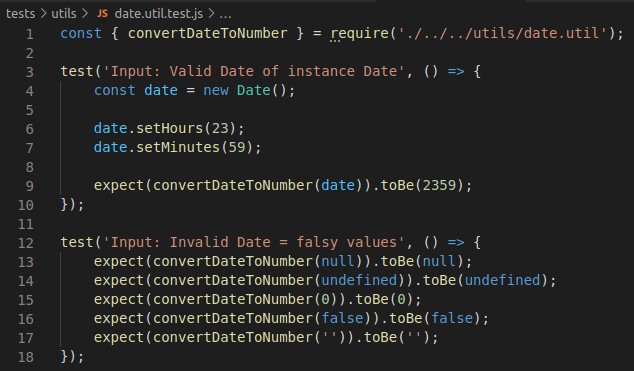

### Integration Testing
This testing tests the methods in the controller associated to the router's endpoints. It mimics req as input.

Function: postMetricByKey

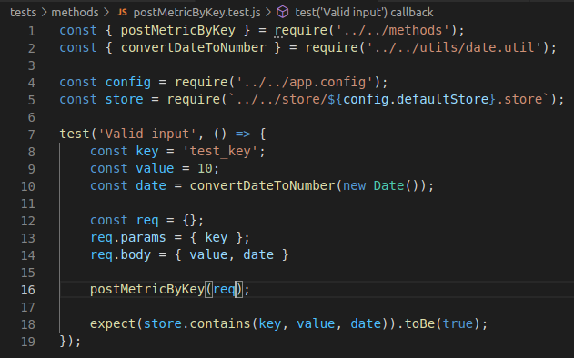

Function: getMetricSumByKey

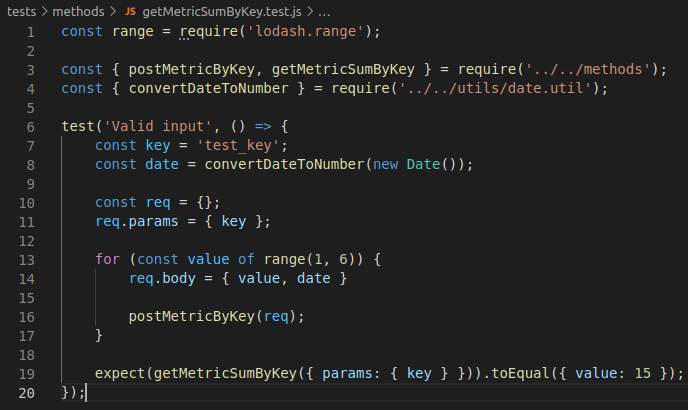

# Performance
Some performance optimization used:
- **Middleware compression**
- **Cron job defined in section Store/Data Structure**

### Benchmark
To decide which is to be used as store/main data structure between Object and Map, I've written a short script:

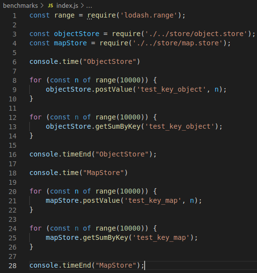

It can be ran using *npm run benchmark*:

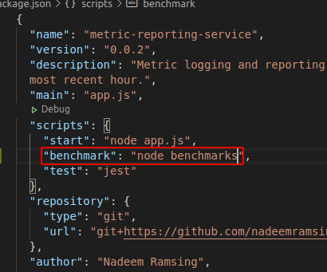

Map won everytime.

# Continuous Integration (CI)
To be sure that new commits was not breaking any existing behavior, GitHub CI was used:

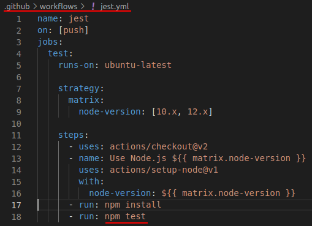

# Deployment
These are the steps I took to deploy my NodeJS service:
- I created a profile in Amazon AWS Lambda

- I set up my credentials locally: 
```
serverless config credentials --provider aws --key key --secret secret
```

- I created a handler for the entrypoint (app.js) of the service in lambda.js:

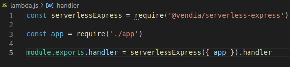

- I created a serverless config file named serverless.yml:

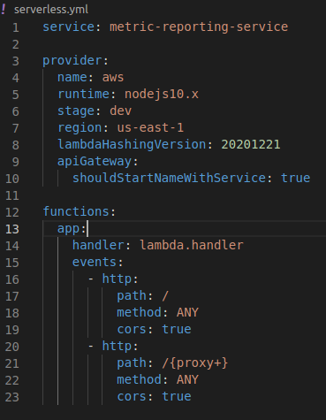

- I ran: 
```
sls deploy
```

### Errors during deployment
Different errors occurred during deployment, but all were due to missing permissions. After adding the following permission, the deployment worked perfectly.

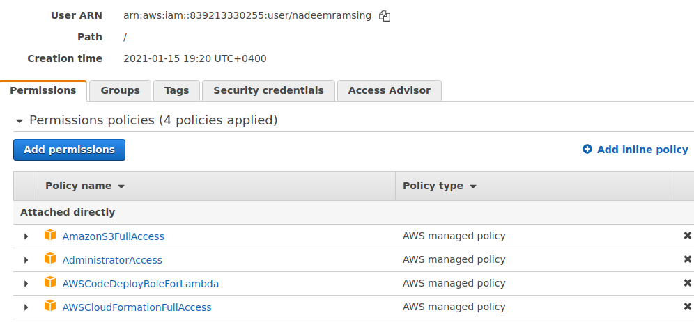