# Acknowledgement
Having never worked with Zoho CRM and the likes of it before, I acknowledge that it has been a nice experience to work with Zoho CRM. I now see it as a very powerful CRM tool. While there was a learning curve, it was relatively easy to use and its documentation and forum has been of great help.

# Requirements
Here is the requirements design I made before planning:
- System should have different types of contact: Residential, Commercial, Farm

- System should have different levels of interest: Cold, Warm, Hot

- TODO: 
    - Automatically send a sequence of tailored emails to each type of contact
    - Frequency:
        - Cold: 4 weeks
        - Warm: 2 weeks
        - Hot: 1 week
    - Sequence:
        - Residential: 10 emails
        - Commercial: 8 emails
        - Farm: 7 emails
    - Each email should be sent once
    - Each email should be sent in the specific ordered sequence (Residential -> Commercial -> Farm)
    - Email sequence needs to begin on the Wednesday of the week after the contact has been added
    - Once emails in sequence run out, no further emails to be sent (stopping condition)
    - CRM User should be able to change the level of interest of any contact at any point
    - CRM User should always know where a contact is in the email sequence
    - When a contact click a link in the email, upgrade his interest level

# Planning
Here is the planning I made before implementation:
- Structure layout:
    - Contact Basic Information (inc. firstname: Single Line, lastname: Single Line, email: Email)
    - Contact Type: Pick List field
    - Contact Interest Level: Pick List field
    - Contact Email Sequence: Single Line

- For email automation, use Schedules
- For on call, upgrade contact's interest level, use Flow > Incoming Webhook Trigger

# Fields
Here are the basic steps I followed to create some fields:
- Click on *Create & Edit Fields*

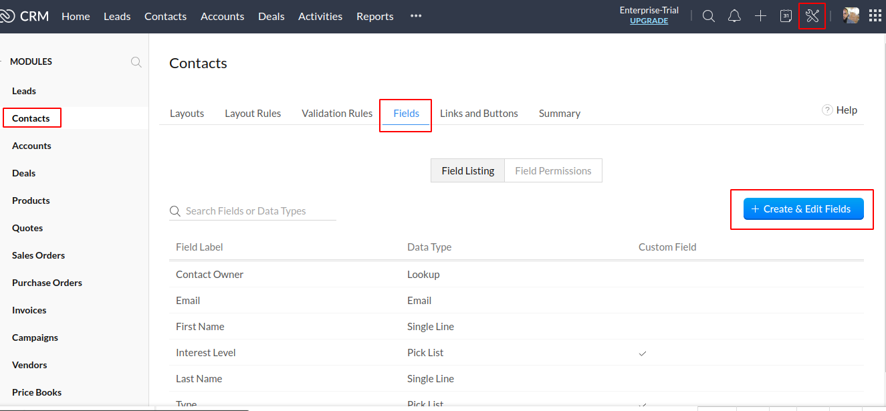

- Add *Type* and *Interest Level* fields

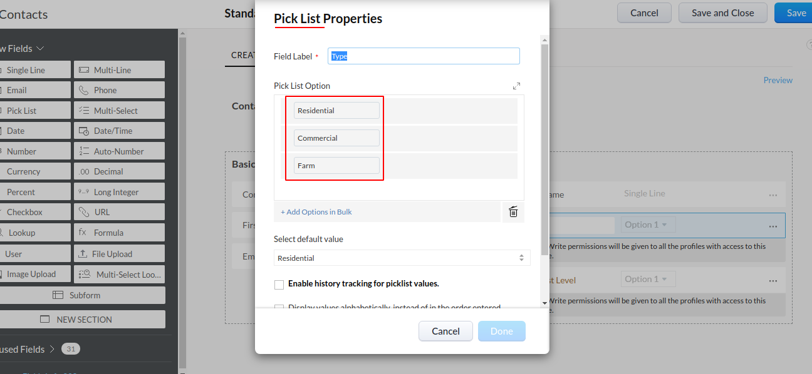

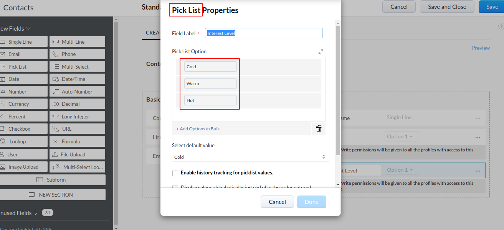

I also added *First Name*, *Last Name* and *Email Sequence* fields.

# Workflow Rule
I created a Workflow Rule with *Create Contact* on trigger to set the initial **Email Sequence** field based on **Type**. As an email is sent based on the Contact's frequency, the Email Sequence field is decremented until it reaches 0. On 0, email is no more sent.

- Click *Settings icon*, then on *Workflow Rules*

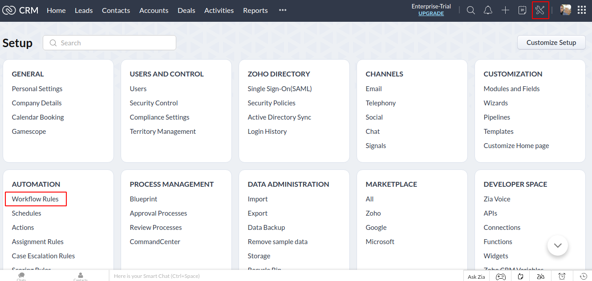

- Trigger: When a contact is created
- Condition: The rule is executed for all contacts
- Instant Action: init_email_sequence

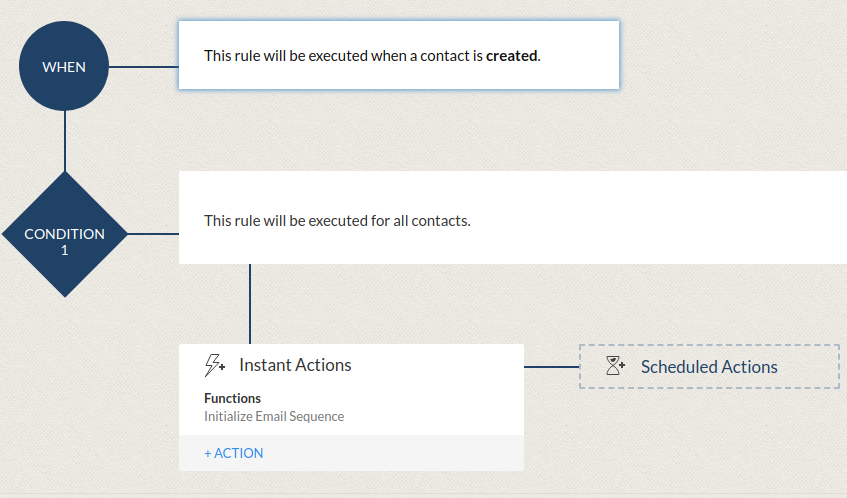

- Custom Function: init_email_sequence(int contactId)
- Algorithm:
    - Get contact by id
    - Get type of contact
    - Initially, emailSequence = 10 (for type == Residential)
    - If type == Commercial then emailSequence = 8
    - If type == Commercial then emailSequence = 7
    - (Note: type is *mutually non-inclusive* imples else does not need to be used)
    - Update emailSequence of contact

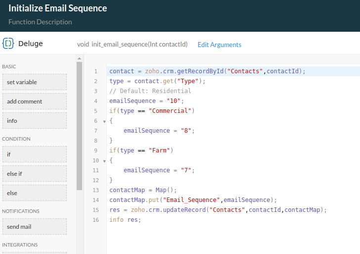

- *Contact Id* is set as argument of init_email_sequence

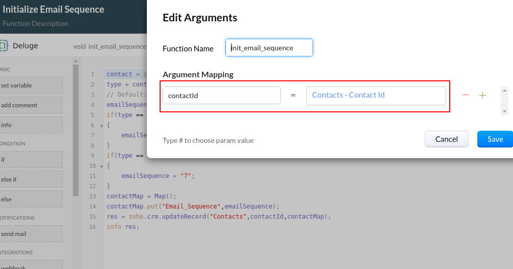

# Schedules
The **Schedule** feature was used to automate email sending. Three different schedules were used to encourage simplicity. Frequency of schedules were easier to set when the three schedules were separated.

- Three schedules: Cold, Warm, Hot

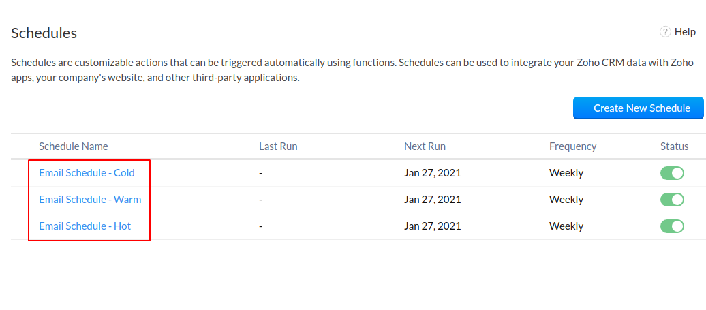

- Cold: Every 4 weeks

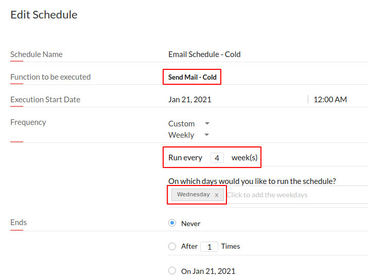

- Warm: Every 2 weeks

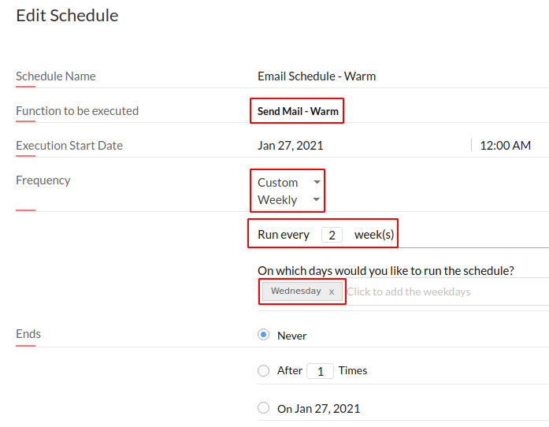

- Hot: Every week

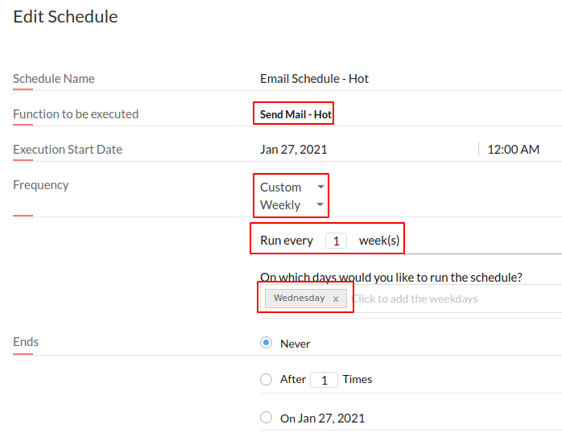

Function name: Send Mail - Cold
```
contactList = zoho.crm.getRecords("Contacts");
for each contact in contactList
{
	interestLevel = contact.get("Interest_Level");
	emailSequence = contact.get("Email_Sequence");
	if(interestLevel != "Cold" || emailSequence == "0" || emailSequence == null)
	{
		continue;
	}
	fullName = contact.get("Full_Name");
	id = contact.get("id");
	sendmail
	[
		from :zoho.loginuserid
		to :contact.get("Email")
		subject :"This is a test email for " + fullName
		message :""
		.concat("<h1>Dear " + fullName + ",</h1>")
		.concat("<p>")
		.concat("This is a test message. ")
		.concat("<br>")
		.concat("Your current interest level is " + interestLevel + ".")
		.concat("</p>")
		.concat("<br>")
		.concat("<a href='https://flow.zoho.com/737611184/flow/webhook/incoming?zapikey=1001.83db607ff5f499304bd3ffb0d6e05911.61dd51c01bad55f5cf21ccd5de1ec131&isdebug=false&contact="+id+"'><button>Show more interest</button></a>")
	]
	body = Map();
	body.put("Email_Sequence",toString(emailSequence.toNumber() - 1));
	res = zoho.crm.updateRecord("Contacts",id,body);
}
```
The **Send Mail - Warm** and **Send Mail - Hot** are the same, except that the condition **interestLevel != "Cold"** uses "Warm" and "Cold" respectively. 

## Best Practices: Separate HTML Template
Instead of hardcoding the Webhook URL in the Custom Function, the html code can be written from a NodeJS microservice and fetched using deluge's getUrl method. Thus, principles to be applied: Separation of Concern, Low Coupling, etc. This will make the html template more testable and maintainable as well.

# Testing

- Here is a test email when the *Save and Execute* button was clicked in the Deluge Code Editor.
- As we can see, on **Show More Interest** button hover, a webhook url appears in Chrome in the bottom.

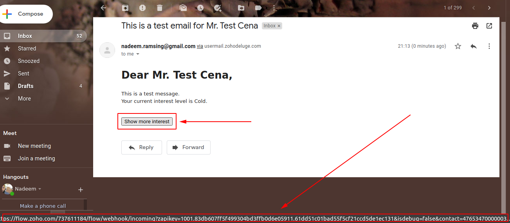

- In *Recent Executions* in Zoho Flow, we can see that our webhook was triggered from the click button action from the email sent. Note that the *Failure* executions happened during other initial tests. 

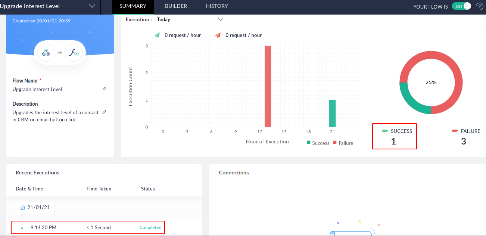

# Flow (Extra Credit)
Flow has been used to implement the **On button click in email, increase interest level of contact** feature.

- Create a WebHook Trigger with JSON as Payload 

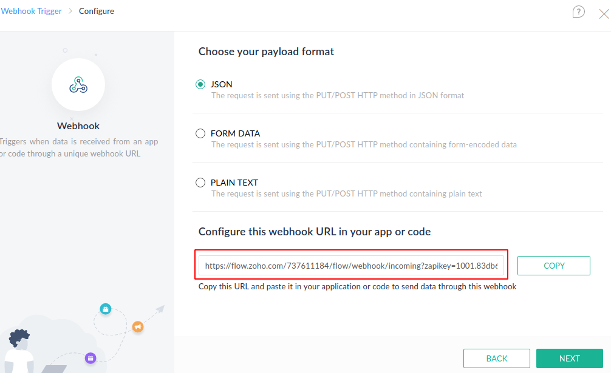

- Custom Function: upgrade_interest_level(string contactId) with ${webhookTrigger.payload.contact} used as argument.
- Algorithm:
    - Get contact by contact id
    - Get interest level (text) from contact
    - Create a map of index-interestLevelText (key-value)
    - Create a map of interestLevelText-index (key-value)
    - Get index of current interest level using textToIndexMap
    - Increment index of current interest level to get index of next interest level
    - Get text of next interest level using indexToTextMap
    - Update contact by id with new interest level

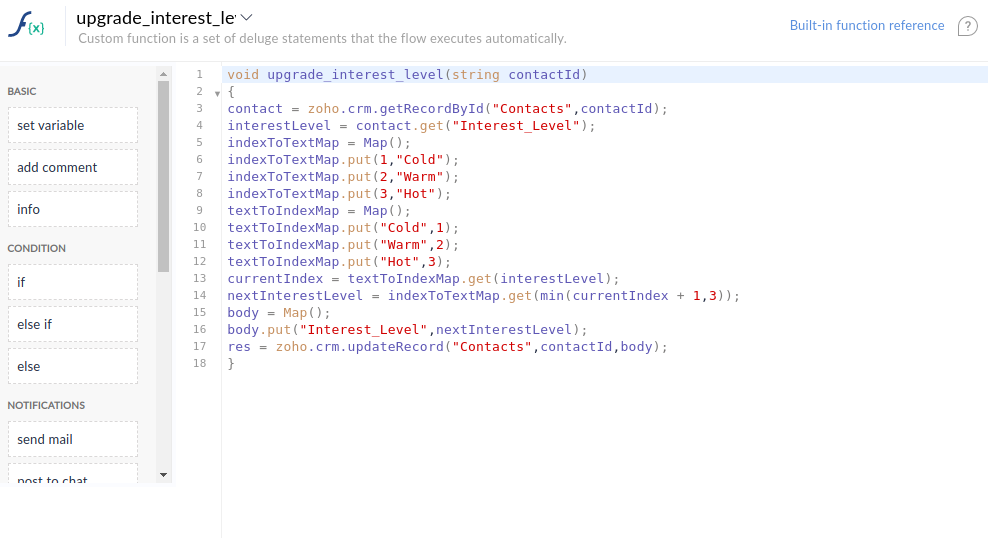

- Drag and drop and custom function to associate it with the webhook

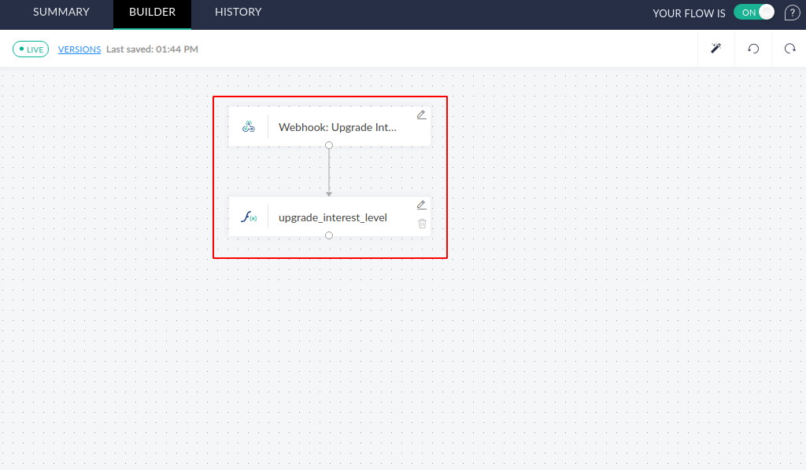

- As previously shown, here is what happens when the button linked to the webhook is clicked in an email. Success means that the custom function upgrade_interest_level ran without throwing any error.

